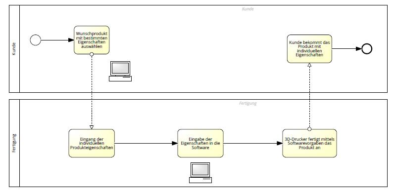

# MASS CUSTOMIZATION ALS ZIEL DER INDUSTRIE 4.0

## 1 Einleitung

„You can converge a toaster and refrigerator, but these things are probably not going to be pleasing to the user“ - Tim Cook

Dieses Zitat von Apple-CEO Tim Cook unterstreicht die Wichtigkeit der Kundenzufriedenheit im Zeitalter der Industrie 4.0. Doch wie lässt sich mit Innovationen des digitalen Zeitalters die Zufriedenheit beim Kunden erhöhen? Dieser Frage wird in der folgenden Arbeit auf den Grund gegangen. Eine mögliche Antwort könnte in der Implementierung von Mass Customization Verfahren liegen. Um sich jedoch der Beantwortung dieser Frage zu nähern wird zunächst festgehalten, was generelle Zielsetzungen der Industrie 4.0 sind. Es erfolgt darüber hinaus eine genauere Betrachtung der Variable Kunden-beziehungen im Zeitalter die Industrie 4.0. Anschließend werden Verfahren aufgezeigt, derer sich Unternehmen im digitalen Zeitalter bedienen, um einerseits die Kundenzufriedenheit zu erhöhen und andererseits weiterhin wirtschaftlich agieren zu können. Dabei liegt das Hauptaugenmerk auf der erfolgreichen Implementierung von Mass Customization Verfahren.

## 2 Ziele der Industrie 4.0

Unter Industrie 4.0 ist zunächst zu verstehen, dass die industrielle Produktion durch Digitalisierungstechniken unterstützt wird. Physische Produktions-anlagen werden mit fortgeschrittener Informationstechnologie ausgestattet und können Produkte dynamisch und weitgehend in Selbstorganisation herstellen (Steven, 2019, S. 14).
Die einschlägige Forschung teilt die industrielle Revolution in momentan vier Stufen ein. Die erste Stufe dabei ist die Erfindung der Dampfmaschine Ende des 18. Jahrhunderts. Die zweite Stufe der industriellen Revolution wurde zu Beginn des 20. Jahrhunderts eingeläutet, indem das Fließband die Produktion beschleunigen konnte. In den 1970er Jahren begann die dritte Stufe. Dort wurden erstmals elektronische und informationstechnische Automatisierungs-verfahren in der Produktion implementiert. Die vierte Stufe der industriellen Revolution bildet die Digitalisierung der Produktionsprozesse und im Zuge dessen die Nutzung virtueller Netzwerke, autonomer Produktionsmittel und der Einsatz digitaler Produktionsprotokolle (Kagermann, 2013, S. 17).
In einer globalisierten Welt setzen sich Unternehmen, die der Maßgabe der Industrie 4.0 folgen wollen, das Ziel, Supply Chains anhand digitalisierter Verfahren zu optimieren. So soll dem Druck der just-in-time Lieferungen standgehalten werden und dem intensiven globalen Wettkampf vorgebeugt werden. Damit geht einher, dass sich einzelne Unternehmen aus unterschiedlichen Stufen der Wertschöpfung zu ganzen Supply Chains zusammenschließen. Die Unternehmen in den sogenannten Industrie 4.0-Netwerken können dadurch ihre einzelne Wertschöpfung erhöhen und Logistik-, sowie Planungsprozesse effizienter durchführen. Das Internet der Dinge, Big Data, Smart Factory und jene Wertschöpfungsnetzwerke sind Treiber der Industrie 4.0. Daher ist ein weiteres Ziel der Industrie 4.0 der stetige Einsatz technologisierter Produktionsverfahren, die im Laufe der letzten Jahrzehnte immer schnellere Innovationszyklen aufwiesen. Darüber hinaus ist das Ziel der Nachhaltigkeit nicht zu vernachlässigen, da die natürlichen Ressourcen der Erde nicht unendlich zur Verfügung stehen.
In dieser Arbeit wird jedoch ein besonderes Augenmerk auf das Ziel der Herstellung individualisierter Produkte in der Industrie 4.0 gelegt. Dieses ist die bessere Abstimmung der Kundenbedürfnisse auf die Eigenschaften des gelieferten Produkts mittels Optimierung der digitalisierten Produktions- und Bestellungsprozesse (Steven, 2019, S. 28-30).

## 3 Kundenbeziehungen in der Industrie 4.0

Das stetige Streben nach Individualität beim Endkonsumenten stellt die Unternehmen im Zeitalter der Industrie 4.0 vor die Herausforderung, individuelle und maßgefertigte Produkte zu entwickeln. Um diese zu meistern, implementieren die Unternehmen nach und nach Bestellprozesse, die agiler auf Kundenwünsche eingehen und letztendlich im Produktionsprozess kongruent eingebunden werden können. Die zunehmende Kaufkraft und die Möglichkeit, Informationen schneller und passgenauer zu beziehen, setzen die Unternehmen unter Druck. Sie sehen sich gezwungen, Leistungen und Endprodukte zu individualisieren. Dieser Vorgang wird Customization genannt. Dabei gilt in der Regel je genauer die Leistung an die Kundenbedürfnisse abgestimmt sind, desto größer ist der wahrgenommene Nutzen (Steven, 2019, S. 170).

## 4 Manifesto for Agile Software Development

Um die Leistungen an den Kunden besser abstimmen zu können, haben Softwareentwickler das „Manifesto for Agile Software Development“ formuliert. Dieses 2001 veröffentlichte Werk ist nach wie vor ein Leitfaden für die Entwicklung agiler Software, die im Zeitalter der Industrie 4.0 implementiert wird. Dabei bilden vier Leitsätze das Gerüst für eine erfolgreiche agile Softwareentwicklung in der Zukunft. So heißt es im Manifest, dass Softwareentwickler „bessere Wege erschließen, Software zu entwickeln, indem [sie] es selbst tun anderen dabei helfen. Durch diese Tätigkeit [wurden] diese Werte schätzen gelernt:

• Individuen und Interaktionen stehen über Prozessen und Werkzeugen

• Funktionierende Software steht über einer umfassenden Dokumentation

• Zusammenarbeit mit dem Kunden steht über der Vertragsverhandlung

• Reagieren auf Veränderung steht über dem Befolgen eines Plans

Das heißt, obwohl [sie] die Werte auf der rechten Seite wichtig finden, schätzen [sie] die Werte auf der linken Seite höher ein“ (Manifesto for Agile Software Development, 2001). Den stärksten Bezug zu der Thematik dieser Hausarbeit hat der Wert der Zusammenarbeit mit dem Kunden. Der Kunde übernimmt im Zuge der Customization immer häufiger den Part des Koproduzenten. Der IKEA-Effekt beispielsweise beschreibt den Kunden als aktiven Part in der Wert-schöpfungskette. Er kauft die Ware unfertig im Möbelhaus ein und baut das Möbelstück auf. Während der Kunde die Ware aktiv zusammenbaut erhöht sich seine Wertschätzung gegenüber dem Endprodukt (Norton et. al., 2012, S.4).

## 5 Mass Customization

Die Mass Customization greift nun diesen Punkt auf und erweitert ihn dahingehend, dass Unternehmen kundenindividualisierte Massenfertigung bieten wollen, um sowohl Skaleneffekte der Massenanfertigung als auch den erhöhten Kundennutzen durch individuelle Produkte erreichen zu können. Da Letzteres mit hohen Kosten verbunden ist, sollen im Zuge der agilen Softwareentwicklung Lösungen gefunden werden, die auf der einen Seite Kosten senken, auf der anderen Seite den Kunden bestmöglich in den Wertschöpfungsprozess einbeziehen (Piller, 2008, S.20).

5.1 Order Penetration Point

Dies gelingt, indem Unternehmen den Order Penetration Point, also den Zeitpunkt, ab dem das Produkt/ ein Bauteil des Produkts einem Kundenauftrag zugerechnet werden kann, möglichst weit in Richtung Endprodukt verlagern. Diejenigen Aktivitäten, die im Prozess dem Order Penetration Point vorgelagert sind (z.B. Materialeinkauf oder Teilmontage) können per Software prognosegetrieben massengefertigt werden. Bei der Endmontage der Bauteile kommt nun der Kniff, dass die Wunschspezifikationen des Kunden berücksichtigt werden können. So erhöht sich im Gegensatz zu herkömmlichen standardisierten Produktionsverfahren die Individualität, wobei die Kosten trotz komplexerer Verfahren gering bleiben können (Steven, 2019, S. 172).
Das Baukastenprinzip beschreibt die Zusammenstellung eines Produkts aus standardisierten Bauteilen und Komponenten. Diese Art der Mass Customization ist bereits vor dem Zeitalter der Industrie 4.0 implementiert worden. In der Automobilindustrie beispielsweise kann der Kunde aus unterschiedlichen Einzelteilen ein individuelles Auto zusammenstellen.

5.2 Additive Fertigung

Neu kommt in der Industrie 4.0 die additive Fertigung hinzu. Dazu zählt eine Gruppe von Fertigungsverfahren, die dreidimensionale Bauteile in einem automatisierten, schichtweisen Prozess aus einem formlosen oder formneutralen Material aufbauen (Klahn, 2018, S. 11). Demnach werden nun Endprodukte exakt nach Kundenwunsch hergestellt. Dies ist dadurch möglich, dass 3D-Drucker via eines vom Kunden gestalteten Modells ein individuelles Produkt erzeugen können. Ein solcher Prozess kann fernab aller von der Massenproduktion vorgegebener Rahmen entstehen. Vorteil dabei ist bei vorhandener Infrastruktur die individuellen Produkte kostengünstig und ohne Einschränkungen herstellen zu können. Ein digitales Modell wird mittels Software erstellt und an ein cyberphysisches System weitergeleitet. An-schließend wird das Endprodukt erzeugt. So lassen sich möglichst viele Ansprüche an die Komponenten des Endproduktes kombinieren (Klahn, 2018, S. 27f.). Durch die Entwicklung von Laserdruckern ist dieser Vorgang in der Praxis umsetzbar geworden. Die Ausgestaltung eines solchen Prozesses der additiven Fertigung lässt sich folgendermaßen vereinfacht darstellen:

Durch die Einbindung des Kunden in den Fertigungsprozess entsteht auf Seiten des Customer Relationship Managements ebenfalls der Vorteil, dass Kunden-daten insoweit genutzt werden können, als dass sich Angebote noch individueller auf Kunden zuschneiden lassen. Somit wird sich im Laufe der Zeit ebenfalls die Kundenzufriedenheit erhöhen (Steven, 2019, S. 173).

## 6 Fazit

Im digitalen Zeitalter nimmt die Mass Customization immer mehr an Bedeutung zu. Gerade im Hinblick auf die Kundenzufriedenheit sehen sich Unternehmen gezwungen, individualisierte Leistungen anzubieten. Durch die Nutzung additiver Fertigung wird der bereits seit den 70er Jahren bestehenden Mass Customization ein weiterer wichtiger Aspekt hinzugefügt. Der Kunde kann nun unbeschränkt Produkte zusammenstellen, die frei von jeglichen Restriktionen sind. Das Unternehmen limitiert die Eigenschaften der Endprodukte somit nicht mehr. Der Kunde ist zufriedener, da er am Ende des Wertschöpfungsprozesses das Produkt bekommt, welches er sich mit genau diesen Eigenschaften schließlich gewünscht hat. Positiver Nebeneffekt ist, dass der Kunde dem Produkt gegenüber positiver eingestellt ist, da er an der Herstellung partizipieren konnte. Grundsätzlich ist zu sagen, dass die additive Fertigung bislang vergleichsweise kurz am Markt ist und die Möglichkeiten, spezifische und individualisierte Produkte herzustellen somit bislang noch stark limitiert ist. Hohe Anschaffungskosten und fehlende Erfahrungswerte schrecken zuweilen viele Unternehmen ab, 3D-Druckverfahren in den Produktionsprozess einzugliedern. Nichts desto trotz wird gerade in der Massenproduktion im Hinblick auf die Kundenzufriedenheit die Zukunft in der Mass Customization liegen. Skaleneffekte werden sich mit der Zeit einstellen, und die Anschaffungskosten für Unternehmen werden mit der Zeit sinken.

## 7 Literaturverzeichnis

Beck et al. (2001). Manifesto For Agile Software Development. Zugriff am 14.10.2019 unter https://agilemanifesto.org/iso/en/manifesto.html

Kagermann, H. et al. (2013). Umsetzungsempfehlungen für das Zukunftsprojekt Industrie 4.0. Plattform Industrie 4.0: Frankfurt am Main.

Klahn et al. (2018). Entwicklung und Konstruktion für die Additive Fertigung. Vogel Business Media GmbH & Co. KG: Würzburg.

Norton et al. (2012). The IKEA Effect: When Labor Leads to Love. Journal of Consumer Psychology 22 (3), p. 453–460.

Piller, F. et al. (2008). Cracking the code of mass customization. Sloan Management Review. Spring 2019.

Steven, M. (2019). Industrie 4.0. Verlag W. Kohlhammer: Stuttgart.
